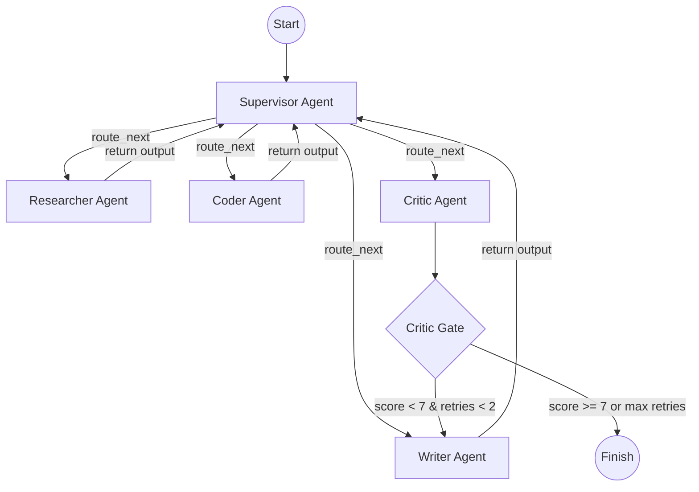

# Hive: Multi-Agent AI System

Hive is an advanced, autonomous multi-agent research and coding orchestrator built using **LangGraph**, **FastAPI**, and **Next.js 15**. It leverages a central supervisor agent to dynamically plan, route, and execute complex technical research tasks.

---

## 🏗️ System Architecture

Hive uses a hub-and-spoke supervisor routing topology where all worker agents report outputs back to the supervisor to coordinate the next steps.



### Specialist Agents & Tools

1. **Supervisor**: Determines the task plan, delegates subtasks, and dynamically routes traffic.
2. **Researcher**: Searches the web using the **Tavily Search API** to fetch up-to-date documentation and code samples.
3. **Coder**: Writes Python scripts and runs them inside an isolated virtual sandbox using **E2B Code Interpreter** to verify execution.
4. **Writer**: Synthesizes the researcher and coder's outputs into a structured, publication-ready markdown report.
5. **Critic**: Evaluates the writer's report draft against the original requirements, loops back to the writer if it fails quality gates, or finishes execution.

---

## 🛠️ Getting Started

### Prerequisites
- Python 3.11 or 3.12
- Node.js 18+ and npm
- Google Gemini API Key (`gemini-2.0-flash`)
- Tavily Search API Key
- E2B API Key (for Coder Agent sandbox)

### Setup Configurations

1. **Clone the repository**:
   ```bash
   git clone https://github.com/Anandakrishnan-VP/Hive.git
   cd Hive
   ```

2. **Configure Environment Variables**:
   Copy `.env.example` in `backend/` and rename it to `.env`:
   ```bash
   cp backend/.env.example backend/.env
   ```
   Fill in the required API keys:
   - `GOOGLE_API_KEY`
   - `TAVILY_API_KEY`
   - `E2B_API_KEY`

---

## 🚀 Running Locally

For quick development, Hive dynamically falls back to **SQLite** and in-memory checkpointing if no PostgreSQL/Redis URLs are supplied in the `.env` file.

### 1. Run Backend Service
```bash
cd backend
python -m venv .venv
source .venv/bin/activate  # On Windows: .venv\Scripts\activate
pip install -r requirements.txt
uvicorn api.main:app --reload --port 8000
```
The backend API will run at `http://localhost:8000`.

### 2. Run Frontend Dashboard
```bash
cd ../frontend
npm install
npm run dev
```
The frontend console will run at `http://localhost:3000`.

---

## 🐳 Running with Docker Compose

To spin up the entire production-ready system (including **Redis** for state checkpointing and **PostgreSQL** for logging):

```bash
docker-compose up --build
```
This launches:
- **FastAPI backend** at `http://localhost:8000`
- **Redis** checkpointer at `redis://localhost:6379/0`
- **PostgreSQL** log database at `postgresql://localhost:5432`

---

## 🤝 Human-in-the-Loop Steering
Hive supports mid-run user interruptions. If an execution is running or looping, you can input a steer command from the UI (e.g., *"Also compare how they handle async execution"*). This immediately injects the feedback into the LangGraph state and instructs the Supervisor to rewrite the execution plan.
