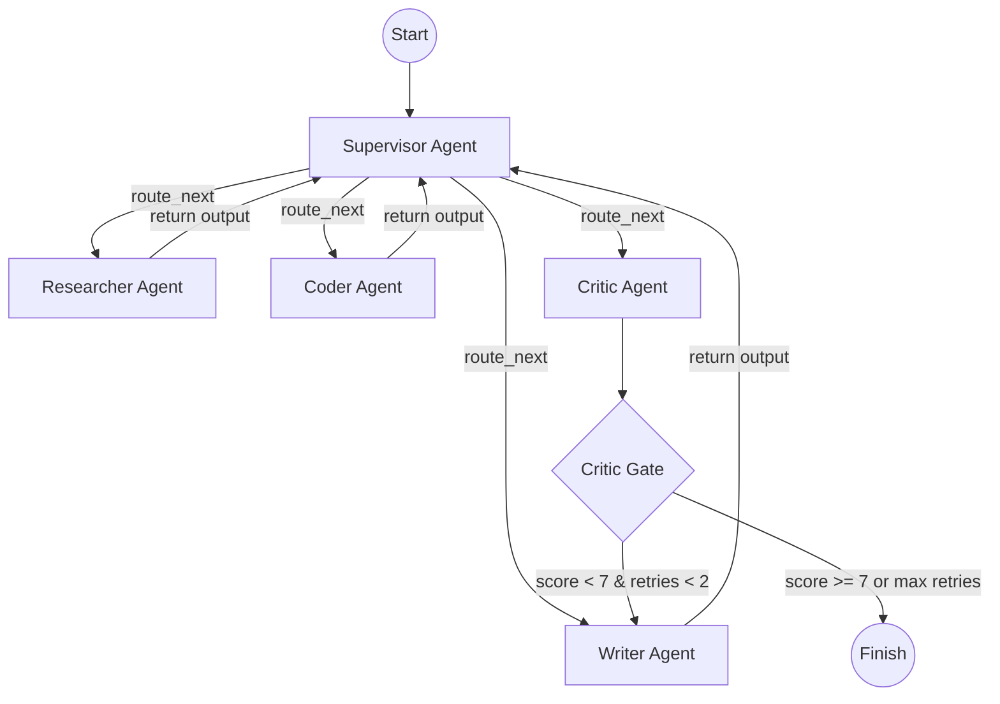

# Hive: Multi-Agent AI System

Hive is an advanced, autonomous multi-agent research and coding orchestrator built using **LangGraph**, **FastAPI**, and **Next.js 16**. It leverages a central supervisor agent to dynamically plan, route, and execute complex technical research tasks.

---

## 🏗️ System Architecture

Hive uses a hub-and-spoke supervisor routing topology where all worker agents report outputs back to the supervisor to coordinate the next steps.



### Specialist Agents & Tools

1. **Supervisor**: Determines the task plan, delegates subtasks, and dynamically routes traffic.
2. **Researcher**: Searches the web using the **Tavily Search API** to fetch up-to-date documentation and code samples.
3. **Coder**: Writes Python scripts and runs them inside an isolated virtual sandbox using **E2B Code Interpreter** to verify execution.
4. **Writer**: Synthesizes the researcher and coder's outputs into a structured, publication-ready markdown report.
5. **Critic**: Evaluates the writer's report draft against the original requirements, loops back to the writer if it fails quality gates, or finishes execution.

---

## 🛠️ Getting Started

### Prerequisites
- Python 3.11 or 3.12
- Node.js 18+ and npm
- **Groq API Key** (for Supervisor, Writer, and Critic)
- **Google Gemini API Key** (for Researcher and Coder)
- **Tavily Search API Key** (for web research)
- **E2B API Key** (for isolated code interpreter sandbox)

### Setup Configurations

1. **Clone the repository**:
   ```bash
   git clone https://github.com/Anandakrishnan-VP/Hive.git
   cd Hive
   ```

2. **Configure Environment Variables**:
   Copy `.env.example` in `backend/` and rename it to `.env`:
   ```bash
   cp backend/.env.example backend/.env
   ```
   Fill in the required keys in `backend/.env`:
   * `GROQ_API_KEY`
   * `GEMINI_API_KEY`
   * `TAVILY_API_KEY`
   * `E2B_API_KEY`
   * `ENVIRONMENT` (Set to `"production"` to enable strict validation checks, or `"development"` for local runs)
   * `ALLOWED_ORIGINS` (Optional comma-separated list of CORS-allowed origins)

3. **Customize Models (Optional)**:
   By default, Hive routes:
   * Supervisor, Writer, and Critic -> Groq (`llama-3.3-70b-versatile`, `llama-3.1-8b-instant`)
   * Researcher and Coder -> Google Gemini (`gemini-2.5-flash`)
   
   You can customize these mappings by overriding the following variables in `backend/.env`:
   * `SUPERVISOR_MODEL` (e.g. `groq/llama-3.3-70b-versatile`)
   * `RESEARCHER_MODEL` (e.g. `gemini/gemini-2.5-flash`)
   * `CODER_MODEL` (e.g. `gemini/gemini-2.5-flash`)
   * `WRITER_MODEL` (e.g. `groq/llama-3.3-70b-versatile`)
   * `CRITIC_MODEL` (e.g. `groq/llama-3.1-8b-instant`)

4. **Database Migrations**:
   When using a PostgreSQL database (like Supabase) in development or production, apply the migrations before running:
   ```bash
   cd backend
   # Set your DATABASE_URL in your terminal environment, then run:
   alembic upgrade head
   ```
   *Note: For local development using SQLite, the tables are automatically initialized on startup.*


---

## 🚀 Running Locally

For quick development, Hive dynamically falls back to **SQLite** and in-memory checkpointing if no PostgreSQL/Redis URLs are supplied in the `.env` file.

### 1. Run Backend Service
```bash
cd backend
python -m venv .venv
source .venv/bin/activate  # On Windows: .venv\Scripts\activate
pip install -r requirements.txt
uvicorn api.main:app --reload --port 8000
```
The backend API will run at `http://localhost:8000`.

### 2. Run Frontend Dashboard
```bash
cd ../frontend
npm install
npm run dev
```
The frontend console will run at `http://localhost:3000`.

---

## 🐳 Running with Docker Compose

To spin up the entire production-ready system locally (including Next.js frontend, FastAPI backend, and PostgreSQL database):

```bash
docker compose up --build
```
This launches:
- **Next.js Frontend** at `http://localhost:3000`
- **FastAPI Backend** at `http://localhost:8000` (mapped to internal container port `7860` for Hugging Face Spaces compatibility)
- **PostgreSQL Database** at `postgresql://localhost:5432`

---

## 🤝 Human-in-the-Loop Steering
Hive supports mid-run user interruptions. If an execution is running or looping, you can input a steer command from the UI (e.g., *"Also compare how they handle async execution"*). This immediately injects the feedback into the LangGraph state and instructs the Supervisor to rewrite the execution plan.

---

## 🗳️ Feedback Collection
Hive collects user feedback to improve routing decisions. Registered operators can rate agent outputs directly from the compiled report tab using the 👍 and 👎 action icons.
